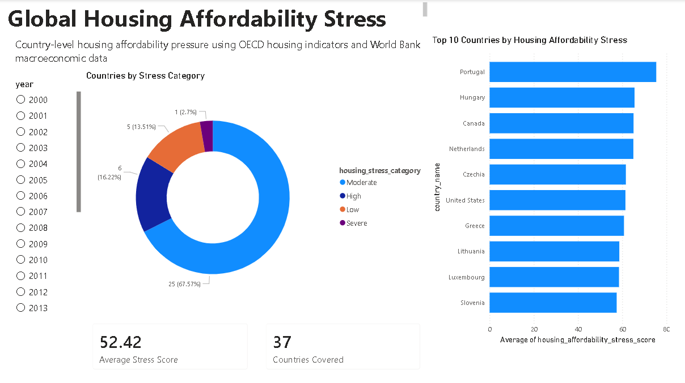
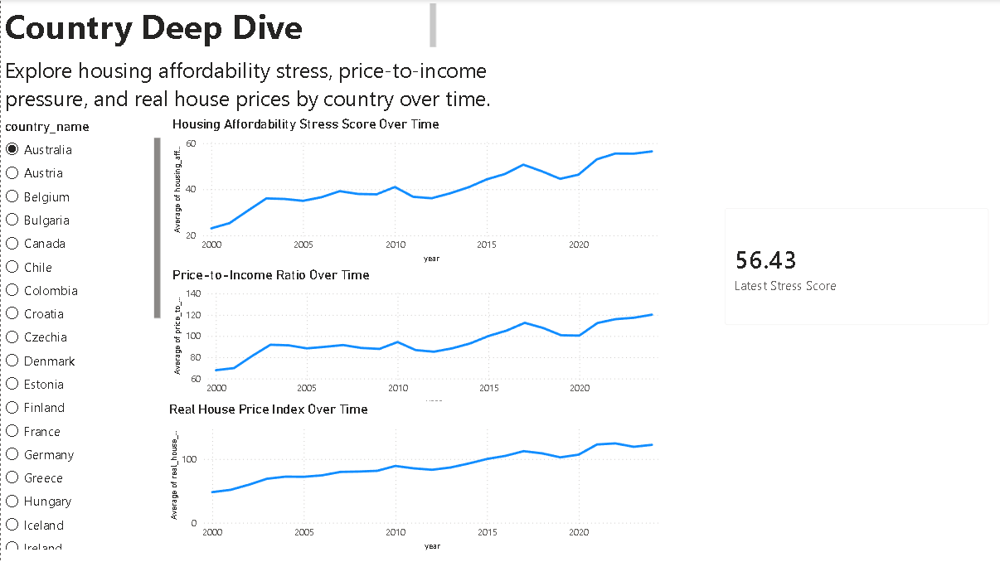
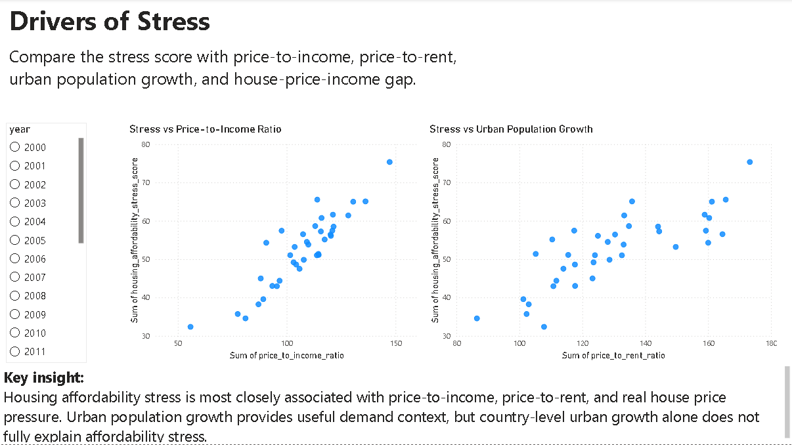
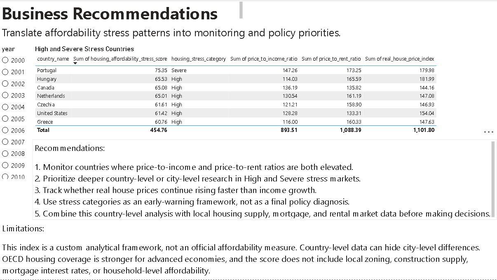

# Global Housing Affordability Stress Index

## Overview

This project analyzes housing affordability pressure across countries using public housing, macroeconomic, and population data.

The goal is to identify which countries are experiencing the highest housing affordability stress, how affordability pressure has changed over time, and which indicators are most associated with housing stress.

## Business Problem

Housing affordability is a growing concern across many countries. House prices, rents, income growth, inflation, and urban population growth all affect whether households can access affordable housing.

This project builds a country-level Housing Affordability Stress Index using public data from OECD and World Bank sources. The final output is an interactive Power BI dashboard and SQL/Python analysis workflow that helps compare affordability pressure across countries.

## Key Questions

1. Which countries have the highest housing affordability stress in the latest year?
2. Which countries have the lowest housing affordability stress?
3. How has housing affordability stress changed over time?
4. Which countries experienced the largest deterioration in affordability stress?
5. Which indicators are most associated with high housing stress?
6. What recommendations can be made for monitoring housing affordability risk?

## Data Sources

- OECD Analytical House Price Indicators
- World Bank World Development Indicators

## Tools Used

- Python
- pandas
- requests
- matplotlib
- SQLite
- SQL
- Power BI
- Git / GitHub

## Project Workflow

1. Collected World Bank country-year macroeconomic and population indicators using the World Bank API.
2. Collected OECD housing indicators including house prices, rent prices, price-to-income, and price-to-rent ratios.
3. Cleaned and reshaped the datasets into country-year format.
4. Joined OECD housing data with World Bank indicators using country code and year.
5. Created year-over-year growth features.
6. Built a custom Housing Affordability Stress Score.
7. Performed exploratory analysis in Python.
8. Loaded the cleaned dataset into SQLite.
9. Wrote SQL queries for rankings, trends, deterioration, and high-stress countries.
10. Built a Power BI dashboard for executive analysis.

## Housing Affordability Stress Score

The custom stress score combines:

- Price-to-income ratio
- Real house price index
- Price-to-rent ratio
- Urban population growth
- House-price-income gap

Each metric was normalized and combined into a 0–100 score.

The weighting used was:

```text
Housing Stress Score =
0.35 * price_to_income_ratio_scaled
+ 0.25 * real_house_price_index_scaled
+ 0.20 * price_to_rent_ratio_scaled
+ 0.10 * urban_population_growth_scaled
+ 0.10 * house_price_income_gap_scaled
```

This is a custom analytical index, not an official affordability measure.

## Main KPIs

- Housing Affordability Stress Score
- Housing Stress Category
- Price-to-Income Ratio
- Price-to-Rent Ratio
- Real House Price Index
- Rent Price Index
- Urban Population Growth
- House-Price-Income Gap
- GDP per Capita
- Inflation
- Unemployment

## Dashboard Preview

### Executive Overview



### Country Deep Dive



### Drivers of Stress



### Recommendations



## Key Insights

- The latest-year stress ranking highlights countries with elevated affordability pressure based on price-to-income, real house prices, and price-to-rent ratios.
- Housing affordability stress is most strongly associated with real house prices, price-to-rent ratios, and price-to-income ratios.
- Urban population growth provides useful demand context, but country-level urban growth alone does not fully explain affordability stress.
- Some countries rank highly because they are currently high stress, while others are important because their stress score deteriorated significantly over time.
- The stress score is best used as an early-warning framework for further analysis, not as a final policy diagnosis.

## Business Recommendations

1. Monitor countries where price-to-income and price-to-rent ratios are both elevated.
2. Prioritize deeper country-level or city-level research in High and Severe stress markets.
3. Track whether real house prices continue rising faster than income growth.
4. Use stress categories as an early-warning framework rather than a final policy conclusion.
5. Combine country-level analysis with local housing supply, mortgage, rental, and zoning data before making decisions.

## Repository Structure

```text
housing-affordability-stress-index/
│
├── README.md
├── requirements.txt
├── data/
│   ├── raw/
│   ├── interim/
│   └── processed/
├── notebooks/
│   ├── 01_data_collection.ipynb
│   ├── 02_data_cleaning.ipynb
│   ├── 03_exploratory_analysis.ipynb
│   ├── 04_sql_database_setup.ipynb
│   └── 05_sql_analysis.ipynb
├── sql/
│   ├── 01_create_tables.sql
│   ├── 02_load_data.sql
│   ├── 03_analysis_queries.sql
│   └── 04_dashboard_marts.sql
├── src/
├── dashboard/
│   ├── powerbi/
│   └── screenshots/
├── reports/
└── images/
```

## How to Run This Project

1. Clone the repository.
2. Create a virtual environment.
3. Install dependencies.

```bash
pip install -r requirements.txt
```

4. Run the notebooks in order:

```text
01_data_collection.ipynb
02_data_cleaning.ipynb
03_exploratory_analysis.ipynb
04_sql_database_setup.ipynb
05_sql_analysis.ipynb
```

5. Open the Power BI dashboard or review the dashboard screenshots.

## Limitations

- OECD housing data has stronger coverage for advanced economies.
- Country-level data can hide major city-level differences.
- Price-to-income and price-to-rent ratios are index-based and should not be interpreted as direct household affordability ratios.
- The stress score is a custom index and depends on selected indicators and weights.
- The project does not include local zoning, mortgage interest rates, construction permits, housing supply, or household-level affordability data.

## Future Improvements

- Add city-level housing affordability data.
- Add mortgage interest rates and construction permit data.
- Add housing supply indicators.
- Build a Streamlit version of the dashboard.
- Add forecasting for future housing stress.
- Add clustering to group countries into affordability profiles.

## Author

Created as a data analytics / junior data science portfolio project focused on global housing affordability, urbanization, and housing pressure.
